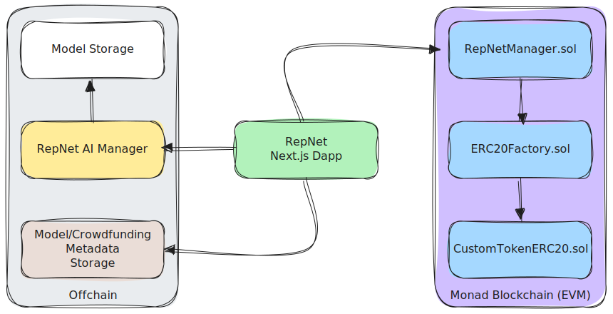

<p align="center">
  
</p>

<h1 align="center">Replicant Network</h1>

<p align="center">
  AI Models. Made for You.
</p>

## ⚠️ Disclaimer

This project is still under heavy development.
Current limitations:
* Due to limited resources on our servers, the model inference can:
    - Be slower than expected.
    - Yield poor results.
    - May not complete at all.
* We are currently running two image generator models, again due to limited resources.
* If Privy Embedded Wallets do not work (due to network congestion), please use external wallets (e.g. MetaMask).

## 🌟 Project Overview

Replicant Network is a decentralized platform that revolutionizes AI model development by creating a transparent and efficient ecosystem for crowdfunding, building, and deploying AI models. Built on Monad's accelerated EVM, it enables:

* **Transparent Crowdfunding**: Anyone can create or contribute to AI model development bounties
* **Submission Testing & Decentralized Voting**: Token holders can test submitted models & vote for the best submission
* **Winning Model Hosting**: Seamless deployment of AI models for inference
* **Tokenization & Shared Ownership**: Models are tokenized, enabling shared ownership and revenue sharing among contributors

Replicant Network leverages Monad's scalability to build a democratized, transparent and permissionless Custom AI Model marketplace. By utilizing Monad's high throughput and near-zero gas fees, our platform will enable seamless transactions for AI model usage while ensuring creators receive fair compensation through revenue sharing. As AI agents become the new websites in the evolving digital landscape, Replicant Network will contribute significantly to Monad's ecosystem expansion, attracting developers and users from both AI and crypto communities, thereby accelerating adoption of the Monad blockchain.

## 🏗️ Architecture

Replicant Network consists of five main components:

1. **Smart Contracts**: Solidity contracts deployed on Monad for crowdfunding, model submission, and token management
2. **Dapp**: Next.js frontend application for interacting with the platform
3. **AI Manager**: FastAPI-based service for managing and running AI inference tasks
4. **Model/Crowdfunding Metadata Storage**: Storage for model and campaign metadata
5. **Model Storage**: Secure storage for AI model files and weights

<p align="center">
  
</p>

## 🚀 How Replicant Network works?


1. **Publish Phase**: A Bounty is created. Bounty Creator provides all the details such as title, detailed description, timelines for each phase, token details, rewards & makes an initial deposit.
2. **Funding Phase**: Contributors fund campaigns and receive model tokens in return. 
3. **Submission Phase**: Developers develop & submit AI solutions. If approved by the team (later decentralized), the model will be added to the list of submissions and will be made available for testing & voting in the next phase.
4. **Voting Phase**: Model Token holders test all models & vote on the best submission. Every eligible voter is allowed to make a single prompt to all of the submitted models.Prompts and generated images are stored in the DB. All of the prompts and generated images are displayed to every eligible voter allowing them to make thoroughly compare both models through his prompts and prompts made by other participants.
5. **Deployment Phase**: Once voting phase finishes (It becomes either Completed or Failed) it becomes "Stale". A transaction is then needed for the Bounty to finalize. Developer of the submission with the most votes gets the bounty & his share of model tokens and the winning model gets deployed for public use by the community.

Take a look at the diagram below for a visual representation of the Custom AI Model lifecycle phases.

<p align="center">
  
</p>

If the bounty fails (there arent any submissions) AI model tokens can be burnt to withdraw MON funded.

## 📁 Repository Structure

```
replicant-network-monorepo/
├── apps/
│   ├── dapp/             # Next.js frontend application
│   ├── ai-manager/       # AI inference service
│   └── envio/            # Indexer for blockchain events
└── contracts/            # Solidity smart contracts
```

## 📚 Documentation Structure
* [Overview](#-project-overview)
* [Technical Documentation](TECHNICAL.md)
* [Smart Contracts](contracts/README.md)
* [Frontend Application](apps/dapp/README.md)
* [AI Manager Service](apps/ai-manager/README.md)

## 🛠️ Technologies Used

* **Blockchain**: Monad (EVM-compatible)
* **Smart Contracts**: Solidity, Foundry
* **Frontend**: Next.js, TypeScript, TailwindCSS, wagmi, Privy
* **Backend**: FastAPI, Python
* **AI**: PyTorch
* **DevOps**: Docker, GitHub Actions

## 🏁 Getting Started

### Prerequisites

* Node.js (v20.18.0 or higher)
* PNPM (v9.14.2 or higher)
* Python 3.10+
* Docker (for AI Manager)

### Installation

1. Clone the repository:
   

```bash
git clone https://github.com/lutralabs/replicant-network-monorepo.git
cd replicant-network-monorepo
```

2. Install dependencies:
   

```bash
pnpm install
```

3. Build all packages:
   

```bash
pnpm build
```

### Running the Dapp

```bash
cd apps/dapp
# Set the variables in .env as seen in .env.example
pnpm dev
```

The application will be available at http://localhost:3000.

### Running the AI Manager

```bash
cd apps/ai-manager
docker-compose up -d
```

The API will be available at http://localhost:8000.

### Deploying Smart Contracts

```bash
cd contracts
forge create src/RepNetManager.sol:RepNetManager --private-key <your-private-key>
```

## 🧪 Testing

```bash
# Run all tests
pnpm test

# Run specific tests
cd contracts
forge test

cd apps/envio
pnpm test
```

## 📄 License

This project is licensed under the MIT License - see the [LICENSE](LICENSE) file for details.
