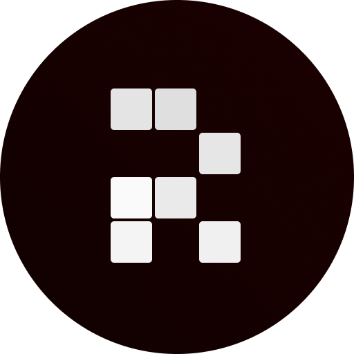

<p align="center">
  
</p>

<h1 align="center">Replicant Network</h1>

<p align="center">
  A decentralized platform for AI model crowdfunding, development, and deployment. It combines blockchain technology with AI infrastructure to create a transparent and efficient ecosystem for AI model creation and utilization.
</p>

## Project Overview

Replicant Network was initially bootstrapped during the Monad Hackathon, where the core concept and architecture were developed. The project aims to democratize AI model development by creating a decentralized marketplace for funding, building, and deploying AI models.

The Replicant Network monorepo contains all the components needed to run the platform:

* **Smart Contracts**: Solidity contracts for crowdfunding, model submission, and token management
* **Dapp**: Next.js frontend application for interacting with the platform
* **AI Manager**: FastAPI-based service for managing and running AI inference tasks

## Repository Structure

```
replicant-network-monorepo/
├── apps/
│   ├── dapp/             # Next.js frontend application
│   │   ├── public/       # Static assets
│   │   └── src/          # Source code
│   └── ai-manager/       # AI inference service
│       ├── src/          # Source code
│       ├── ai-models/    # AI model storage
│       └── benchmarking/ # Performance testing
├── assets/               # Shared assets (logos, images)
└── contracts/            # Solidity smart contracts
     ├── src/              # Contract source code
     ├── test/             # Contract tests
     ├── script/           # Contract related scripts
     └── lib/              # Dependencies
```

## Key Components

### Smart Contracts

The contracts module contains Solidity smart contracts that power the Replicant Network:

* **RepNetManager**: Main contract for managing crowdfunding campaigns, model submissions, and voting
* **ModelToken**: ERC20 token implementation for model-specific tokens
* **ERC20Factory**: Factory contract for creating new model tokens

### Dapp (Frontend)

A Next.js application that provides the user interface for:

* Browsing and participating in crowdfunding campaigns
* Submitting AI models
* Voting on model submissions
* Interacting with deployed models

### AI Manager

A Python-based service that handles:

* AI model inference via a REST API
* Asynchronous processing of AI tasks using Celery
* Model discovery and management
* Performance monitoring and scaling

## Getting Started

### Prerequisites

* Node.js (v20.18.0 or higher)
* PNPM (v9.14.2 or higher)
* Python 3.10+
* Docker and Docker Compose (for AI Manager)

### Installation

1. Clone the repository:
   

```
git clone https://github.com/your-org/replicant-network-monorepo.git
cd replicant-network-monorepo
```

2. Install dependencies:
   

```
pnpm install
```

3. Build all packages:
   

```
pnpm build
```

### Running the Dapp

```
cd apps/dapp
pnpm dev
```

The application will be available at http://localhost:3000.

### Running the AI Manager

```
cd apps/ai-manager
docker-compose up -d
```

The API will be available at http://localhost:8000.

### Deploying Smart Contracts

```
cd contracts
forge create src/RepNetManager.sol:RepNetManager --private-key monad-deployer --broadcast
```

## Development

This monorepo uses NX for managing the workspace and dependencies. Common commands:

* `pnpm nx run-many --target=build`: Build all packages
* `pnpm nx run-many --target=test`: Run tests for all packages
* `pnpm nx run-many --target=lint`: Lint all packages

## License

MIT
